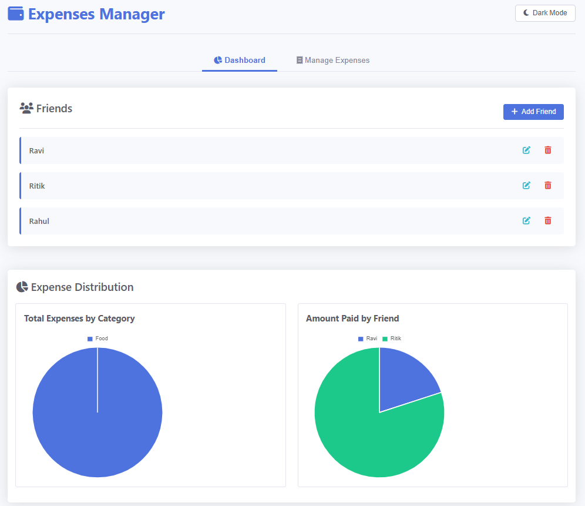
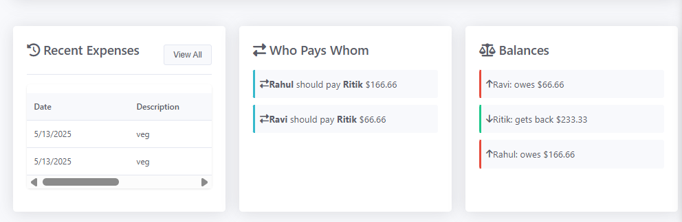
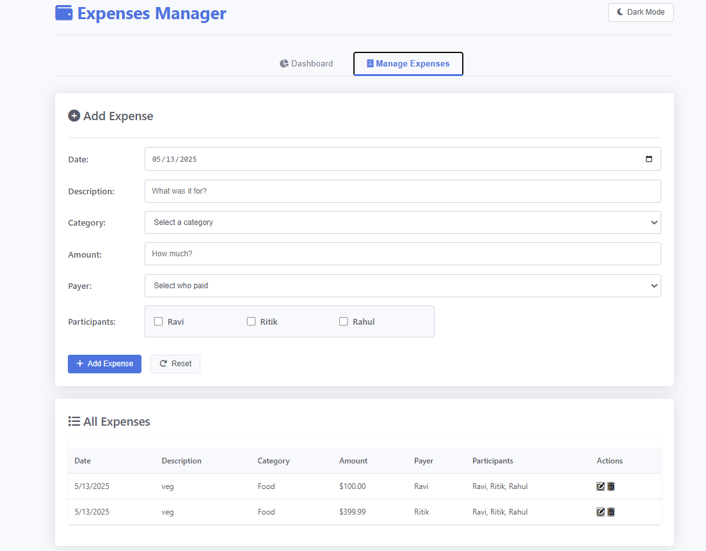

# 💸 Expenses Manager

A sleek and professional **web-based application** to manage shared expenses among friends — with intuitive design and **visual analytics** to make group spending simple.

---

## 🌟 Features

### 🧭 User-Friendly Dashboard
- 📊 Visual expense breakdown with pie charts
- 💰 Quick summary of balances
- 🔄 "Who Pays Whom" settlement suggestions
- 🕒 Recent expense activity overview

### 🧾 Expense Management
- ➕ Add, ✏️ edit, and 🗑️ delete expenses with categories
- 👥 Split costs among selected friends
- 🧮 Responsive tabular view of all transactions

### 👤 Friend Management
- 👨‍👩‍👧‍👦 Add, edit, and remove friends
- 🔍 Track individual balances
- 📈 Visualize each friend's contribution

### 🤝 Settlements
- 🧠 Auto-calculated optimal payment routes
- 👀 Clear “who owes whom” summaries
- 🚀 Fewer transactions = easier settlements

### 📈 Data Visualization
- 🍕 Expense distribution by category
- 💸 Contributions by each friend
- ✅ Balance indicators with color cues

---

## 🧪 How to Use

### 📊 **Dashboard**
1. View total and per-category expenses
2. Track who paid what
3. See recent activity
4. Check settlement suggestions

### 💼 **Manage Friends**
1. Click **"Add Friend"**
2. Enter name → Save
3. Edit/delete anytime

### 💵 **Manage Expenses**
1. Click **"Add Expense"**
2. Fill in:
   - 📅 Date
   - 📝 Description
   - 🗂️ Category
   - 💵 Amount
   - 🙋‍♂️ Payer
   - ✅ Participants (check all involved)
3. Click **"Add Expense"**
4. Payer must be included in participants

---

## 📘 Example Workflow

1. Add 3 friends: `Alice`, `Bob`, and `Charlie`  
2. Add an expense:
   - Date: `May 13, 2025`
   - Description: `Dinner`
   - Category: `Food`
   - Amount: `$60`
   - Payer: `Alice`
   - Participants: `Alice`, `Bob`, `Charlie`
3. On the dashboard:
   - 🍽️ Dinner cost split 3 ways → $20 each
   - Alice paid $60 → gets back $40
   - Bob and Charlie each owe $20
   - Settlement:  
     - `Bob ➜ Alice: $20`  
     - `Charlie ➜ Alice: $20`

---

## 🛠️ Tech Stack

| Technology     | Role                                 |
|----------------|--------------------------------------|
| `HTML5`        | Structure                            |
| `CSS3`         | Styling + Responsive Design          |
| `Vanilla JS`   | Core Functionality                   |
| `Chart.js`     | Data Visualization                   |
| `Font Awesome` | Icons                                |
| `localStorage` | Persistent, offline data management  |

---

## 🚀 Getting Started

Just download or clone the repo, and **open `index.html` in any modern web browser**.

📁 No installation required. No server setup needed.  
🧠 All your data is securely stored in your **browser’s localStorage**.

---

## 📸 Screenshots 
--Dashboard Tab--
> 
> 

--Manage Expenses Tab--
> 

---

## 🙌 Contributing

Pull requests are welcome! Feel free to open issues for feature requests, bug reports, or suggestions.

---

> Built with ❤️ to make group spending stress-free.
